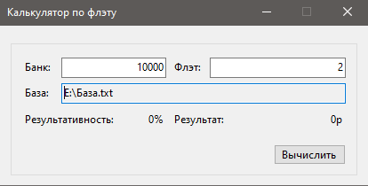

# CalcFlat

## Описание

Программа высчитывает результативность ставок с учетом флэта

## Скриншот программы

## База

Результат | Коэффициент
------- | --------
+|2,11
+|1,97
+|1,56
+|1,67
-|2,03
+|1,77
-|1,64
+|1,55
+|1,6
-|1,85
+|1,65
+|1,96
-|1,8
-|2,01
+|1,73
+|1,76
+|2,02
+|1,84
-|1,86
-|1,79
0|1,64
+|1,83
0|1,78
0|1,62
+|1,73
+|1,5
+|1,54
0|1,55
+|1,88

